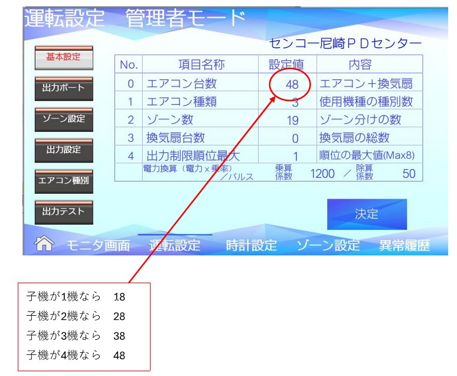

# エコミラ 子機削減時の設定変更マニュアル

Version 1.0  
最終更新：2026-03-16

---

## 概要

エコミラの子機台数が減った場合は、  
**エアコン台数の設定値を変更することで対応します。**

例  
子機が **4台 → 1台** になった場合  
→ **エアコン台数設定を変更**

---

## 設定画面



---

## 設定変更手順

### 1. 管理者モードを開く

```
運転設定 → 管理者モード
```

---

### 2. 基本設定を選択

左メニューから

```
基本設定
```

を選択します。

---

### 3. エアコン台数を変更

画面の以下の項目を変更します。

| No | 項目 | 内容 |
|---|---|---|
| 0 | エアコン台数 | 子機台数に応じて変更 |

---

## 子機台数と設定値

| 子機台数 | エアコン台数設定 |
|---|---|
| 子機1台 | 18 |
| 子機2台 | 28 |
| 子機3台 | 38 |
| 子機4台 | 48 |

---

## 設定保存

設定変更後

```
決定
```

ボタンを押して保存します。

---

## 注意事項

- 子機の増減があった場合は **必ず設定変更する**
- 設定変更後は **モニター画面で動作確認**
- 台数設定が間違っていると **制御対象がずれる可能性あり**

---

## 関連マニュアル

- 子機追加設定マニュアル
- エコミラ基本設定マニュアル
- エコミラ通信設定マニュアル
