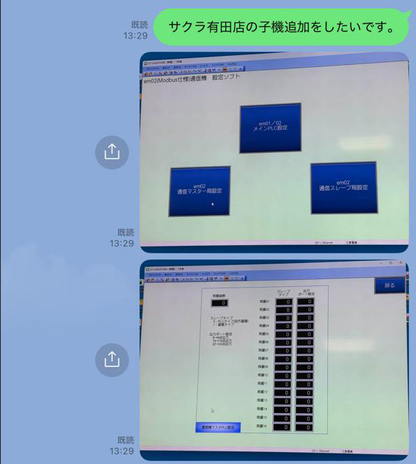
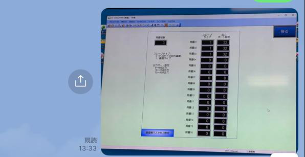
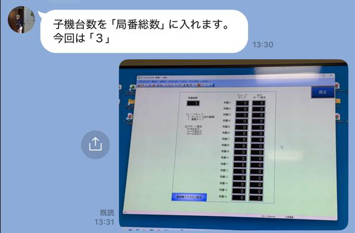
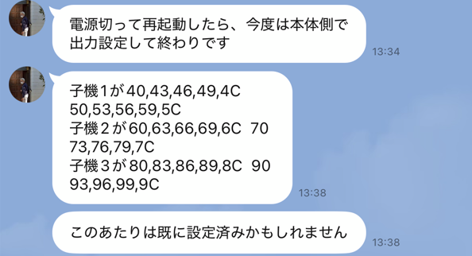
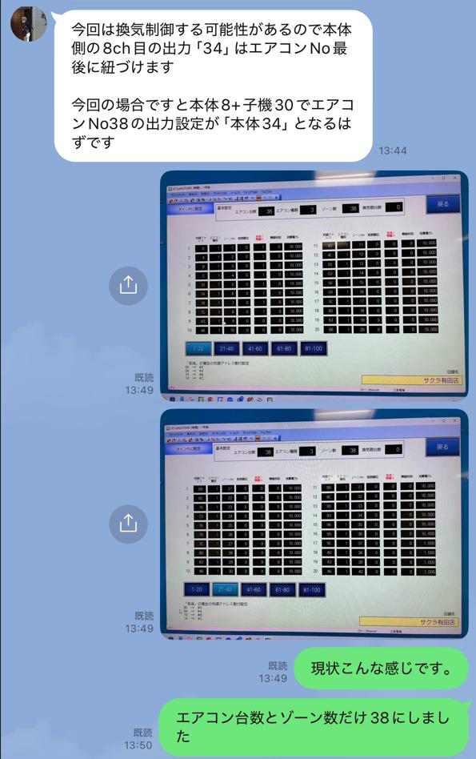
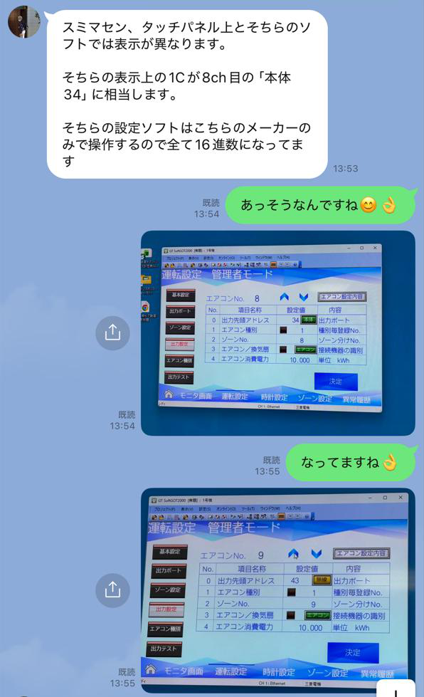
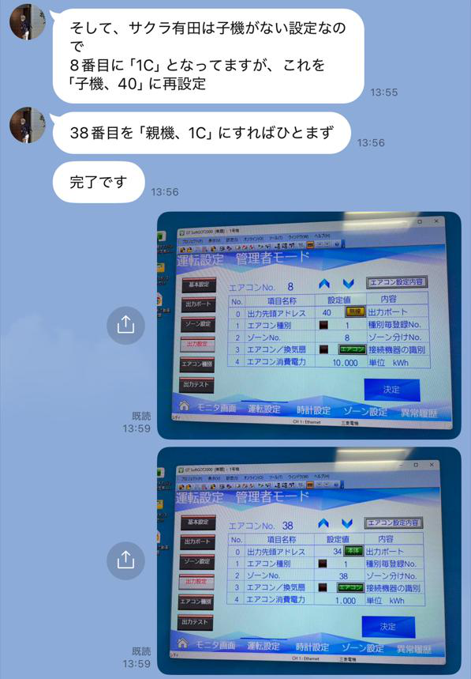

# エコミラ 子機追加設定手順書

Version 1.0  
2026-02-26

---
## 目次

1. 概要
2. 設定手順
3. 子機リレーアドレス
4. 出力アドレス設定
5. 再起動
6. 確認方法
7. 注意事項
   
## 概要

エコミラに子機を追加する場合、
親機側で子機台数および出力アドレスの設定を行う必要があります。
本手順書では、子機3台を追加する場合の設定方法を説明します。

---

## 設定手順

### STEP 1：管理画面でエアコン台数とゾーン数を設定する

PCから遠隔でエコミラと接続し、管理画面でエアコン台数とゾーン数を **38** にする。

---

### STEP 2：設定ソフトを起動する

1. **SOFT GOT** を終了する
2. **エコミラem01-02設定ソフト.GTX** を起動する
3. **em02通信マスター側設定ボタン** を押す

---

### STEP 3：局番総数（子機台数）を設定する

- 「局番総数」に子機台数を入力する
- 今回は **3** を入力

> ⚠️ 数値を書き込むと即座に反映されます。決定ボタンはありません。

---

### STEP 4：スレーブタイプと出力設定ポートを設定する

- 局番1〜3の **スレーブタイプ** を **1**（通信タイプ）に設定
- **出力設定ポート** を **32** に設定

---

### STEP 5：子機のリレーアドレスを確認する

各子機に割り当てられるリレーNo.とアドレスは以下の通り。

#### 子機1

| リレーNo | 1 | 2 | 3 | 4 | 5 |
|---------|---|---|---|---|---|
| アドレス | 40 | 43 | 46 | 49 | 4C |

| リレーNo | 6 | 7 | 8 | 9 | 10 |
|---------|---|---|---|---|---|
| アドレス | 50 | 53 | 56 | 59 | 5C |

#### 子機2

| リレーNo | 1 | 2 | 3 | 4 | 5 |
|---------|---|---|---|---|---|
| アドレス | 60 | 63 | 66 | 69 | 6C |

| リレーNo | 6 | 7 | 8 | 9 | 10 |
|---------|---|---|---|---|---|
| アドレス | 70 | 73 | 76 | 79 | 7C |

#### 子機3

| リレーNo | 1 | 2 | 3 | 4 | 5 |
|---------|---|---|---|---|---|
| アドレス | 80 | 83 | 86 | 89 | 8C |

| リレーNo | 6 | 7 | 8 | 9 | 10 |
|---------|---|---|---|---|---|
| アドレス | 90 | 93 | 96 | 99 | 9C |

---

### STEP 6：本体側の出力アドレスを設定する

設定ソフトを閉じた後、本体側（タッチパネル）で出力設定を行う。

> ⚠️ 設定ソフトとタッチパネルでは表示が異なります。  
> 設定ソフトは16進数表示です。タッチパネル上の「1C」は8ch目の「本体34」に相当します。

#### 8ch目の出力アドレスを変更する

- 変更前：親機8番目のアドレス **34**（2進数で1C）
- 変更後：子機1番目のアドレス **40** に変更

#### 38ch目の出力アドレスを変更する

- 変更前：**38**
- 変更後：親機8番目のアドレス **34**（1C）に変更

---

### STEP 7：設定を完了し再起動する

1. 設定ソフトを閉じる
2. エコミラのブレーカーを **OFF** にする
3. ブレーカーを **ON** にする

---

### STEP 8：設定内容を確認する

再起動後、以下のアドレスになっていることを確認する。

| Ch | 設定値 | 内容 |
|----|--------|------|
| 8ch目 | 40 | 子機1番目のアドレス |
| 9ch目 | 43 | 子機2番目のアドレス |
| 38ch目 | 34（1C） | 親機8番目のアドレス |

---

## 注意事項

- 数値入力は即時反映されるため、決定ボタンはない
- 設定ソフトは16進数表示、タッチパネルは異なる表示形式
- 換気制御がある場合、本体側8ch目の出力をエアコンNo.最後に紐づける必要がある

---

## 更新履歴

| Version | 日付 | 内容 |
|---------|------|------|
| 1.0 | 2026-02-26 | 初版作成 |