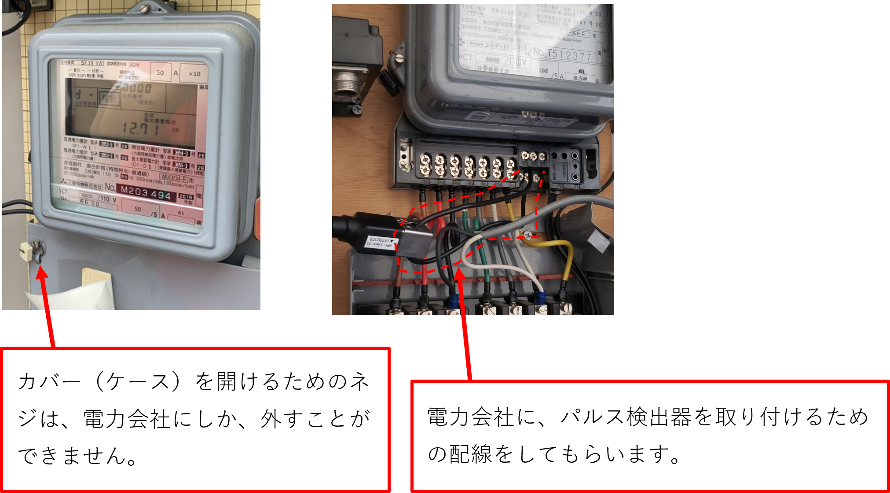
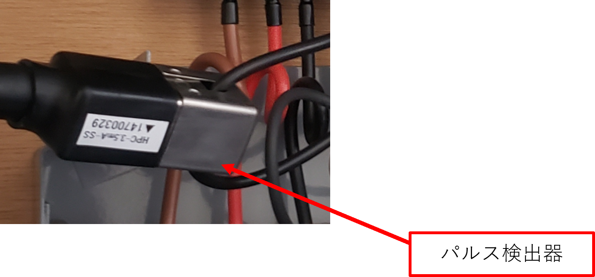
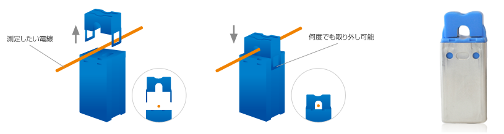

# パルス検出器 取付要領

Version 1.0  
最終更新日：2023-06-03

---

## 概要

電力メーターにパルス検出器を取り付けるための手順です。  
電力会社と工事会社の役割を分けて作業を行います。

---

## 対象

・現場施工担当者  
・工事会社  
・エコミラ設置担当者  

---

## ゴール

・パルス検出器が正しく取り付けできる  
・役割分担（電力会社／工事会社）が理解できる  

---

## 手順

### ① 電力メーターへの配線（電力会社）

電力会社に依頼して、電力メーターの配線を行います。

・メーターのカバー（ケース）を開けてもらう  
・パルス検出器用の配線を出してもらう  

👉 カバーのネジは電力会社しか外せません 

---

### ② パルス検出器の取付（工事会社）

電力会社が用意した配線に、パルス検出器を取り付けます。

・この作業は工事会社が行う  
・既に別のパルス検出器があっても同じ配線に取付可能 

---

### ③ パルス検出器の取付方法

・測定したい電線にクランプする  
・取り外しは何度でも可能  

👉 電線を挟むだけで測定可能（非接触タイプ）

---

## 注意事項

・メーターのカバーは勝手に開けない  
・電力会社との事前調整が必要  
・誤った電線に取り付けない  

---

## トラブル対応

### パルスが取れない場合

・取り付け位置を確認する  
・対象電線を再確認する  
・電力会社の配線内容を確認する  

---

## メモ

配線は蓋の外に出してもらい、パルス検出器を取り外しできるようにしてもらうのがベスト。