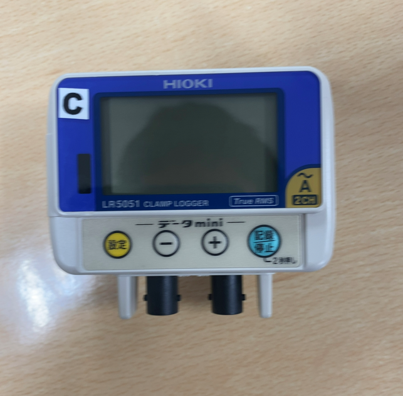
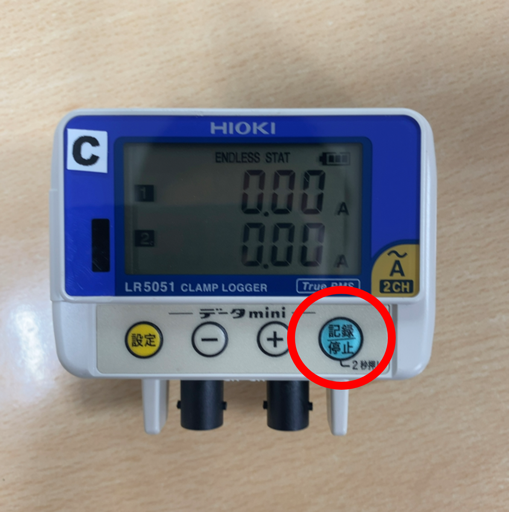
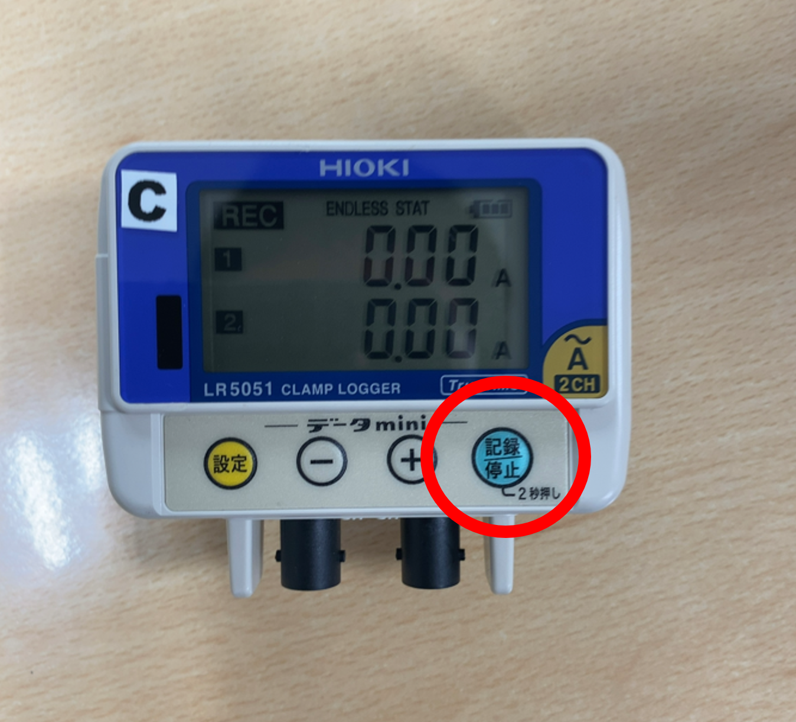
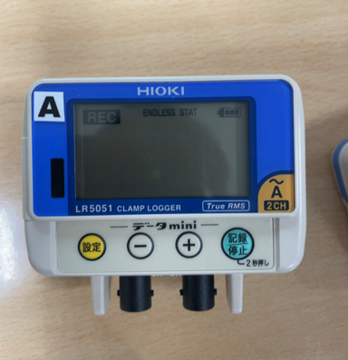

# 電流ロガー 現地設定マニュアル（R5051）

Version 1.0
最終更新日：2026-03-21

---

## ■ 概要

電流ロガー（R5051）を現地で設定し、
電流データの記録（REC）を開始する手順です。

---

## ■ 対象

・現場施工担当者
・電流測定担当者

---

## ■ ゴール

・ロガーの電源を入れる
・記録（REC）状態にする
・測定を開始できる

---

## ■ 手順

---

### ■ ① 初期状態

・画面は何も表示されていない

👉 電源OFF状態 

---

### ■ ② 電源ON

#### 操作

・「記録停止」ボタンを1回押す。

#### 状態

・画面が表示される
・数値（0.00Aなど）が出る

👉 電源ON完了 

---

### ■ ③ REC（記録開始）

#### 操作

・「記録停止」ボタンを4秒押し続ける

#### 状態

・画面に「REC」と表示される

👉 記録開始状態 

---

### ■ ④ REC完了（測定中）

#### 状態

・REC表示が出たままになる
・しばらくすると安定表示になる

👉 これで測定開始完了 

---

## ■ 注意事項

・REC表示が出ていることを必ず確認
・表示が出ていない場合は再操作
・現場を離れる前に必ず確認

---

## ■ トラブル対応

### ■ RECにならない

・ボタンを長押ししているか確認
・電源ON状態か確認

---

### ■ 表示が出ない

・電池を確認
・接触不良を確認

---

## ■ 最重要ポイント

👉 「REC表示」が出ているかがすべて

---

## ■ メモ

（現場ごとに記入）
