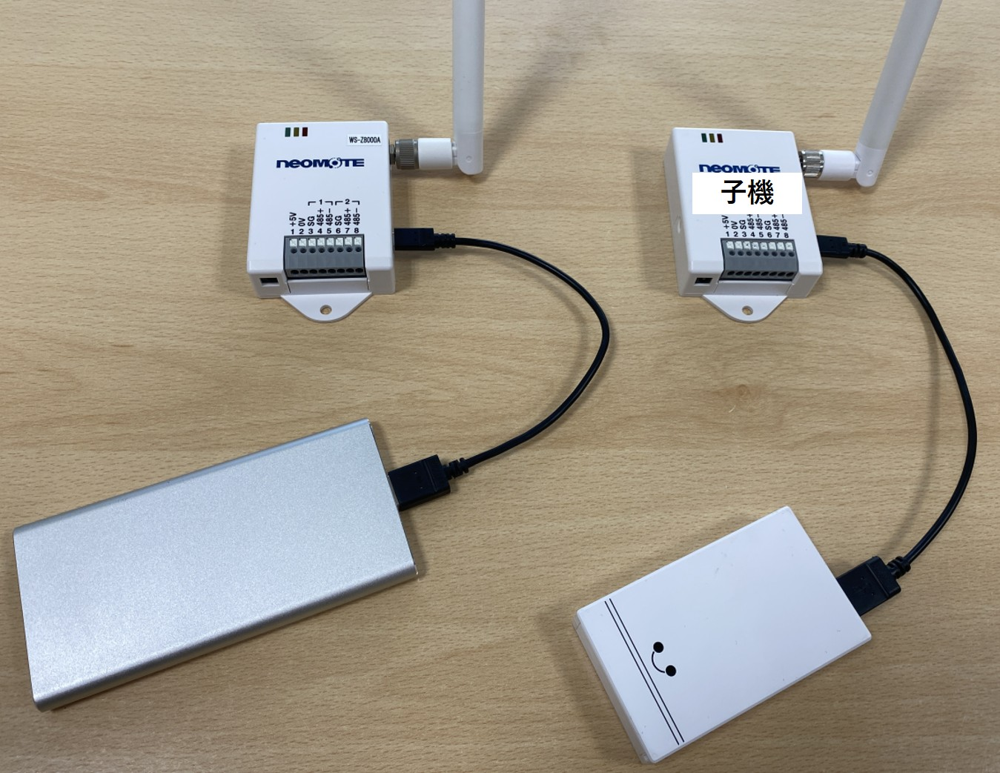
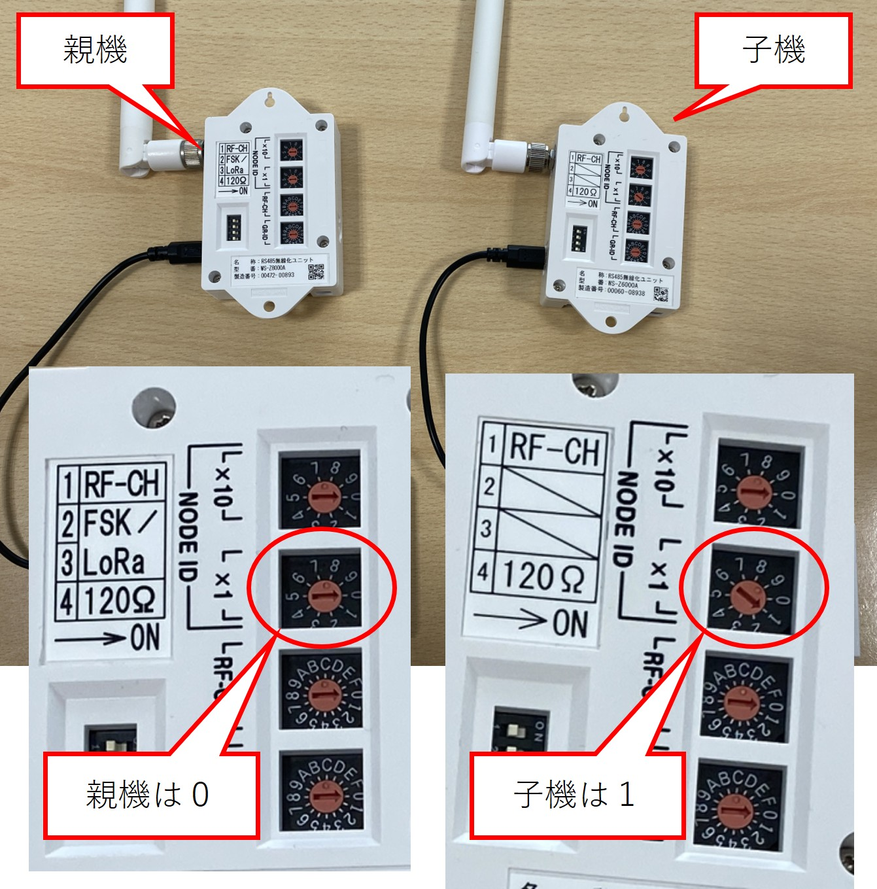
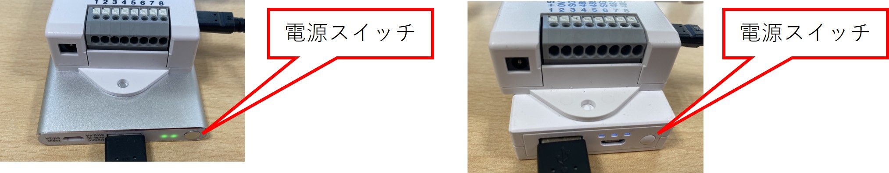
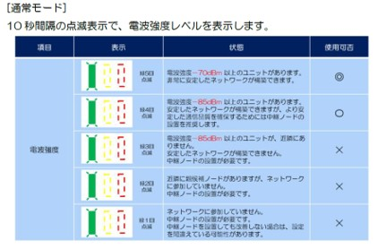
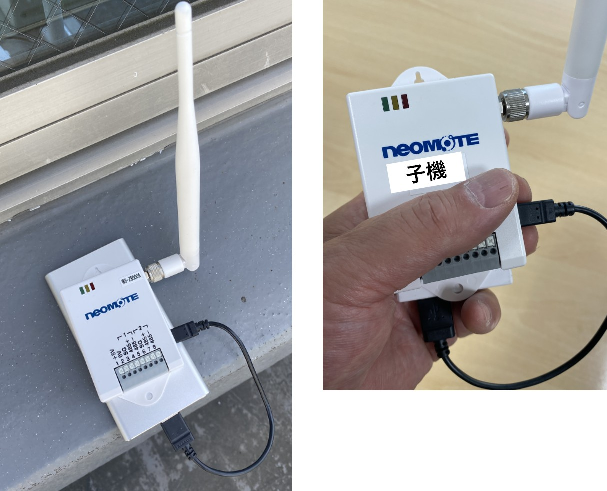

# ネオモト無線確認方法

Version 1.0  
最終更新日：2026-03-21

---

## 概要

ネオモト無線機（親機・子機）の通信確認を行う手順です。  
設置前・工事時の動作確認に使用します。

---

## 対象

・現場施工担当者  
・エコミラ設置担当者  

---

## 手順

### ① ネオモトにバッテリーを接続

ネオモト（親機・子機）にバッテリーを接続します。

※注意  
・バッテリーは常時電力供給が可能な「IOT対応バッテリー」を使用してください  
・携帯用バッテリーでは代用できません 

---

### ② ノードIDの確認

親機と子機の設定を確認します。

| 機器 | ノードID |
|------|----------|
| 親機 （エコミラ本体側） | 0 |
| 子機 （電力メーター側）| 1 |

※必ずこの設定にしてください 

---

### ③ バッテリーの電源を入れる

バッテリーの電源スイッチをONにします。

・親機、子機ともに電源を入れる  
・電源投入後、通信が開始されます  

---

### ④ 親機の通信確認

両方の電源を入れると、しばらくして  
子機（node=1）の左端の緑ランプが10秒間隔で点滅します 

#### 点滅回数の意味

| 点滅回数 | 状態 |
|----------|------|
| 5回 | 非常に良好 |
| 4回 | 良好 |
| 3回以下 | 通信不安定 |

※最大は5回点滅です

---

### ⑤ 通信確認の方法

1. 親機（node=0）を電力メーター付近に設置  
2. 子機（node=1）を持って移動する
4. 緑ランプの点滅回数を確認  

👉 4〜5回点滅する場所を探します 

---

## 注意事項

・ノードID設定ミスに注意  
・バッテリー種類を必ず確認  
・通信確認は必ず現地で実施  

---

## トラブル対応

### 通信が弱い場合

・設置位置を変更する  
・中継ポイントを検討する  

---

## メモ

実際は、親機がエコミラ側だが、親機はランプが点滅しないため、子機を持って移動して確認する