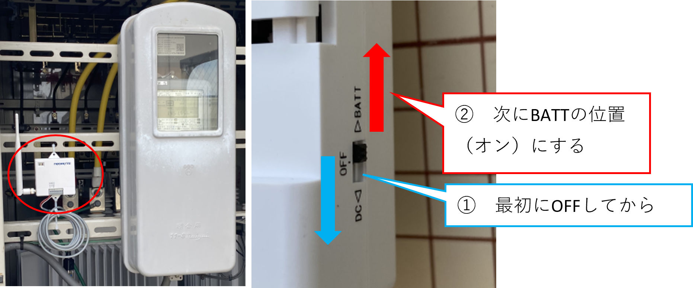
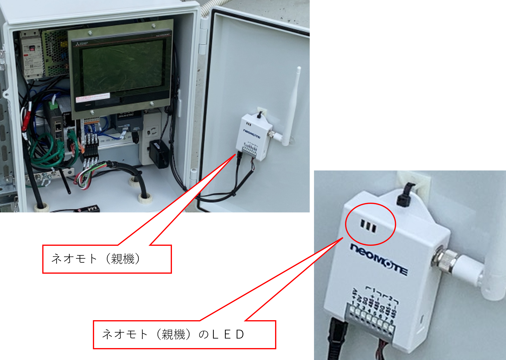

# ネオモト通信確認方法（電力メーター）

Version 1.0  
最終更新日：2023-06-03

---

## 概要

電力メーターに接続されたネオモト無線機（子機）と、  
エコミラ側の無線機（親機）の通信確認を行う手順です。

---

## 対象

・現場施工担当者  
・エコミラ設置担当者  

---

## ゴール

・子機と親機が通信できているか確認できる  
・通信不可時の判断ができる  

---

## 手順

### ① 子機の電源を入れ直す

電力メーター側のネオモト（子機）の電源を操作します。

1. 一度「OFF」にする  
2. その後「BATT（ON）」にする  

👉 必ず「OFF → ON」の順で行う

---

### ② 親機のLEDを確認する

子機の電源を入れてから数秒後に、  
エコミラに接続されているネオモト（親機）のLEDを確認します。

---

## 判定方法

### ■ 通信OK

・親機のLEDが一瞬光る  

👉 通信できている状態 

---

### ■ 通信NG

・LEDが光らない  

👉 無線通信ができていない状態  
👉 中継器の設置が必要

---

## 注意事項

・必ず子機の電源を入れ直してから確認する  
・確認は数秒待ってから行う  
・LEDの一瞬の点灯を見逃さない  

---

## トラブル対応

### 通信できない場合

・設置位置を見直す  
・中継器の設置を検討する  

---

## メモ

