# ネオモト簡易設定マニュアル

Version 1.0  
最終更新日：2024-XX-XX

---

## 概要

ネオモト（WS-Z8000Aおよび各ノード）の基本設定方法です。  
PC設定ツールおよびスイッチ設定の両方を扱います。
エコミラの場合、基本的に
電力メーター側（子機）のネオモトの　node=1
エコミラ側（親機）のネオモトの　node=0　にするだけでよい。

---

## 対象

・現場施工担当者  
・通信設定担当者  
・OEM設定担当者  

---

## ゴール

・無線ネットワークが構築できる  
・各ノードが通信できる状態になる  

---

## システム構成

親機を中心に無線ネットワークを構築します。

- 親機（WS-Z8000A）
- 中継機（WS-Z8000A）
- 子機（各センサノード）

👉 無線（920MHz）＋RS485で構成 

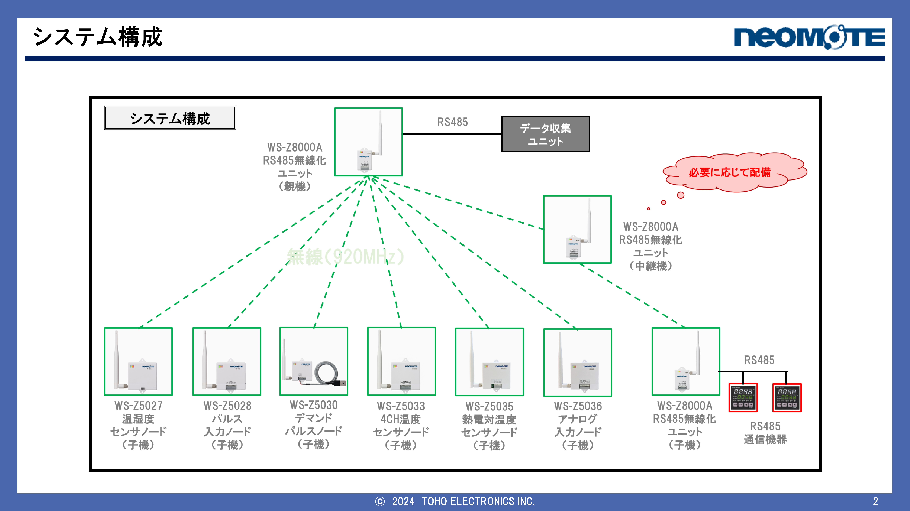
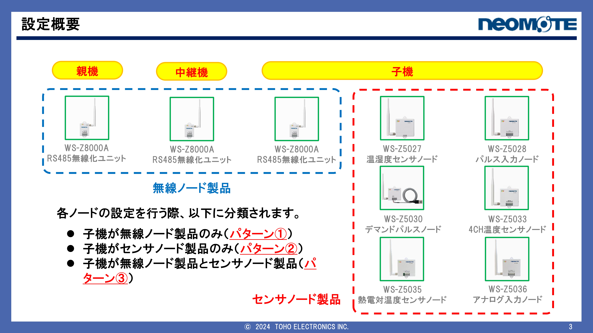
---

## 設定の考え方（超重要）

無線ネットワークは以下4つで決まります👇

| 項目 | 内容 |
|------|------|
| NODE-ID | 機器の番号（重複NG） |
| RF-CH | 無線チャネル（全機器同じ） |
| GR-ID | グループID（全機器同じ） |
| 無線モード | 通信方式（全機器同じ） |

👉 この4つを揃えれば通信できる 

---

# ■ 設定方法①（PC設定ツール）

## 対象
WS-Z8000A（親機・中継機）

---

### ① PC接続

・USBでPCと接続  
・設定ツールを起動  

---

### ② 通信設定

・RS485機器に合わせて設定  
・親機と子機は同じ設定にする  

👉 ここズレると通信不可

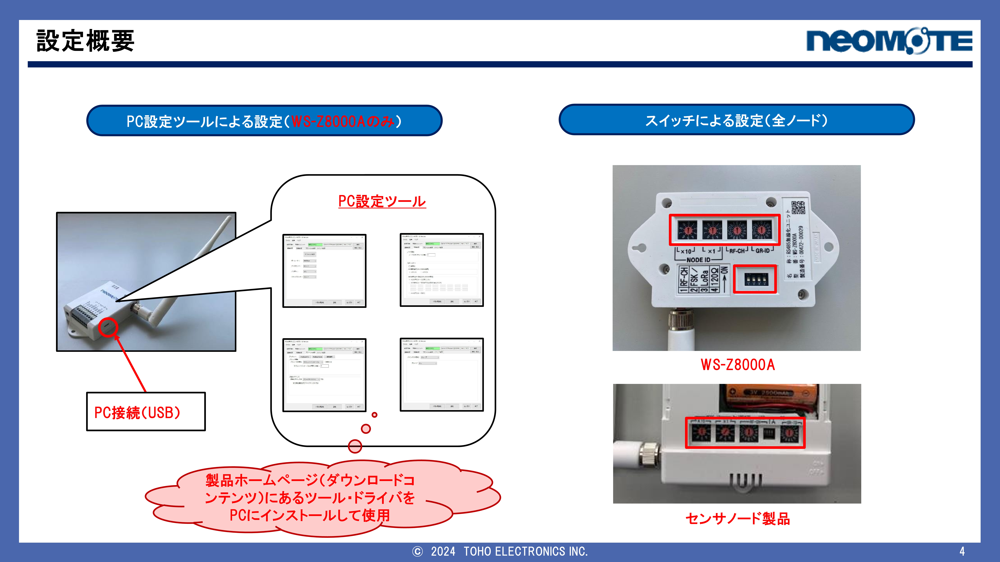
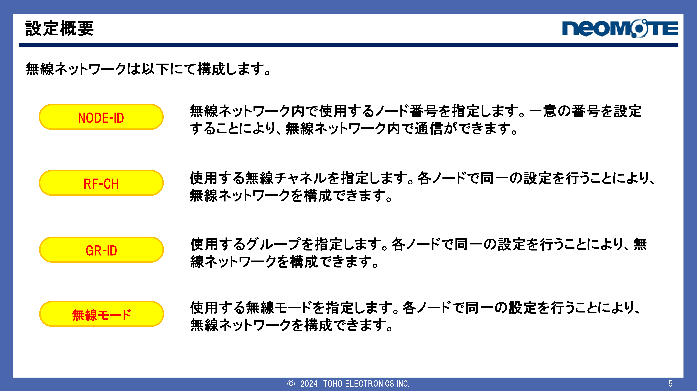
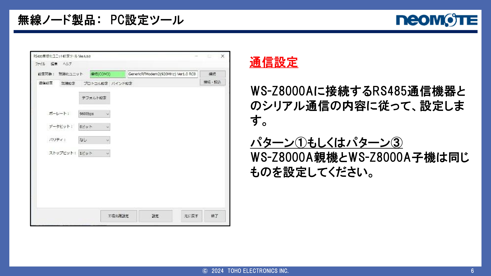
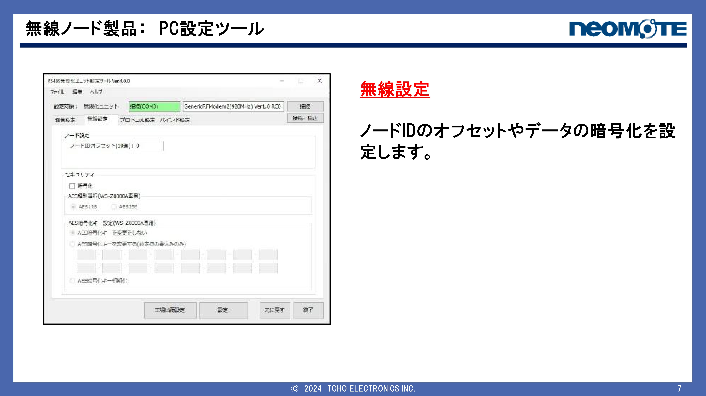
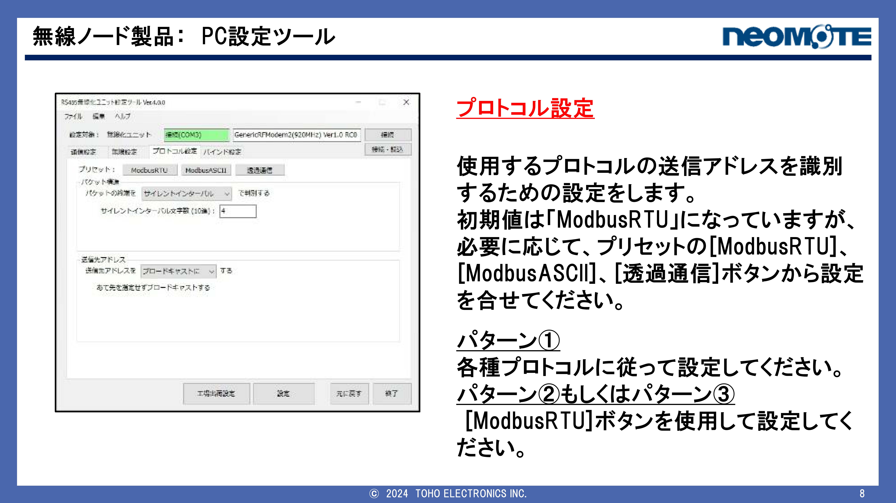
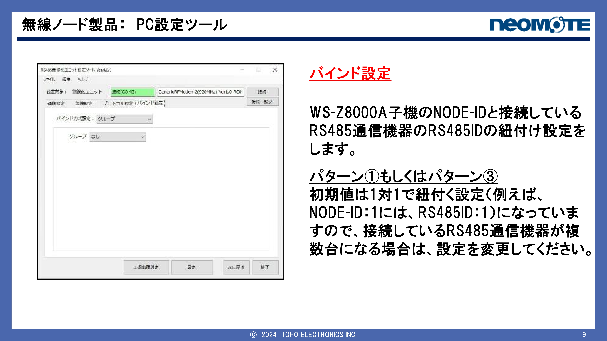

---

### ③ 無線設定

・ノードIDオフセット設定  
・必要に応じて暗号化設定  

---

### ④ プロトコル設定

・基本は ModbusRTU  
・必要に応じて変更  

---

### ⑤ バインド設定

・NODE-IDとRS485機器を紐付け  

例  
NODE-ID：1 → RS485 ID：1  

👉 複数機器の場合は変更 
---

# ■ 設定方法②（スイッチ設定）

## 対象
全ノード（親機・子機・中継機）

---

### ■ ノードID

- 親機：0  
- 子機・中継機：1〜99  

---

### ■ 無線チャネル（RF-CH）

👉 全機器で同じにする

---

### ■ グループID（GR-ID）

👉 全機器で同じにする

---

### ■ 無線モード

| モード | 特徴 |
|--------|------|
| FSK | 中距離・速度重視 |
| LoRa_SF7 | 長距離・速度重視 |
| LoRa_SF9 | 長距離・バランス |
| LoRa_SF11 | 長距離・距離重視 |

👉 全機器で同じにする
---

# ■ 終端抵抗（RS485）

## ■ 1台接続
👉 基本OFF推奨

---

## ■ 複数接続

👉 両端のみON  

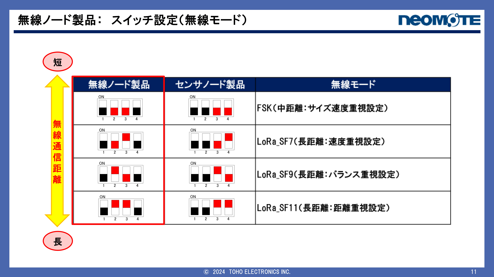
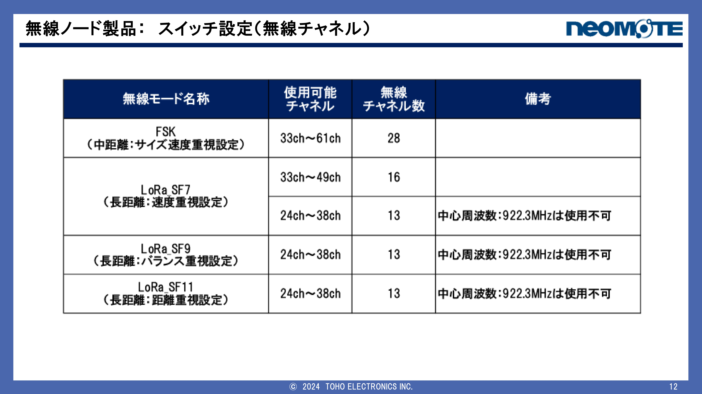
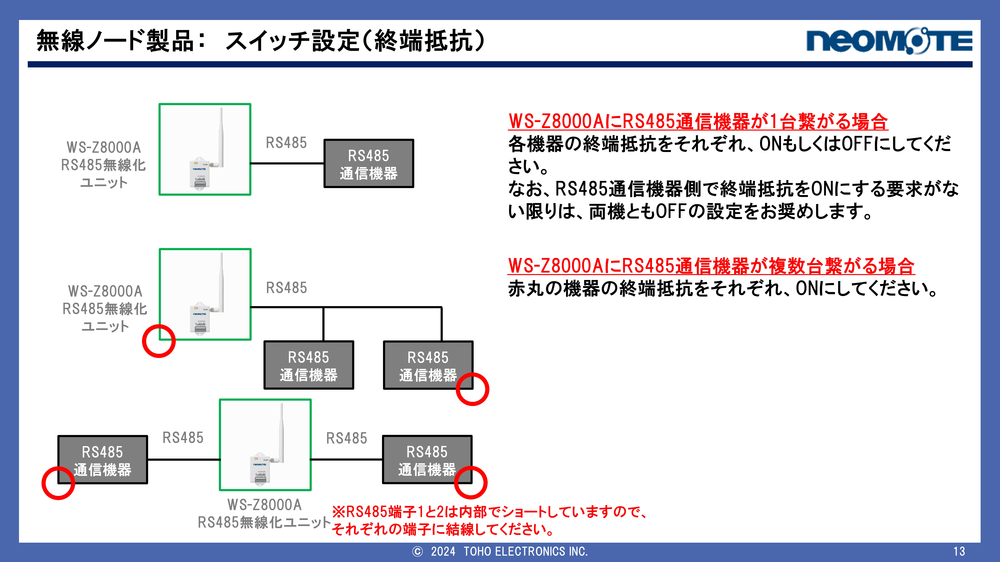

---

# ■ センサノード設定

## ■ データ送信間隔

1分に1回（変更可能）

例：
- 10秒
- 30秒
- 60秒（デフォルト）

---

## ■ 設定手順

1. スイッチ設定  
2. 電源ON  
3. ボタン3秒押し  
4. LED点滅確認  
5. 電源OFF  

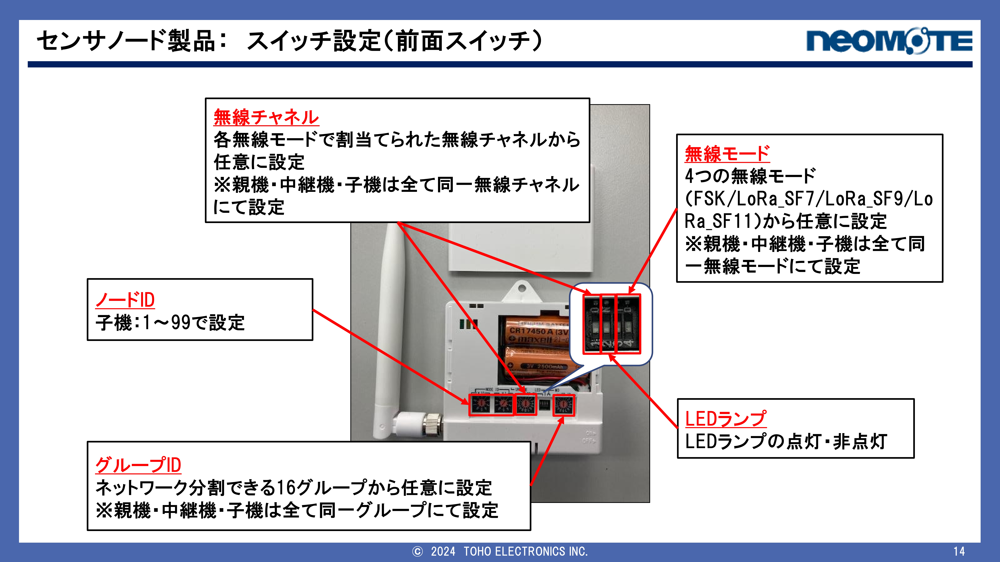
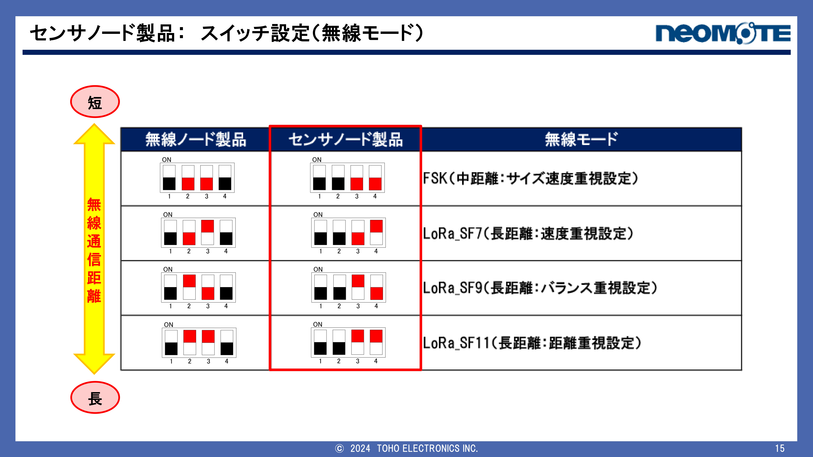
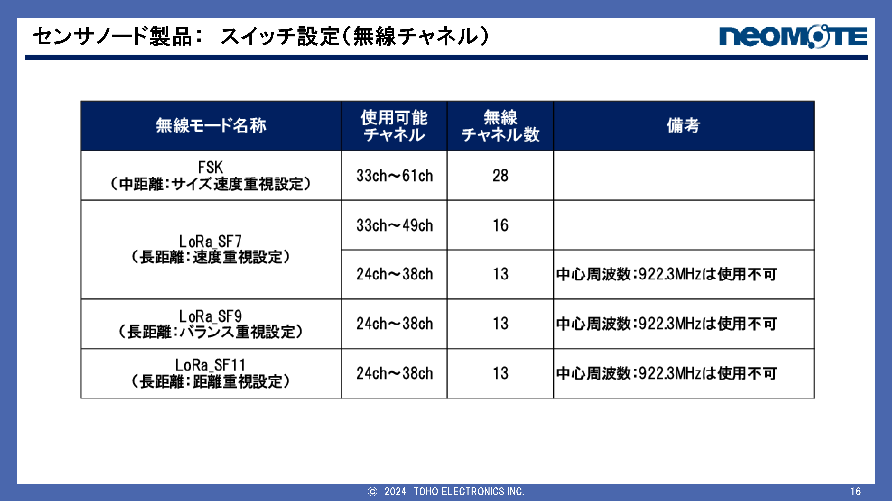

---

# ■ 特殊設定

## ■ パルス入力（WS-Z5028）

チャタリング除去設定あり

| 状態 | 内容 |
|------|------|
| OFF | 高速パルス対応 |
| ON | ノイズ対策 |

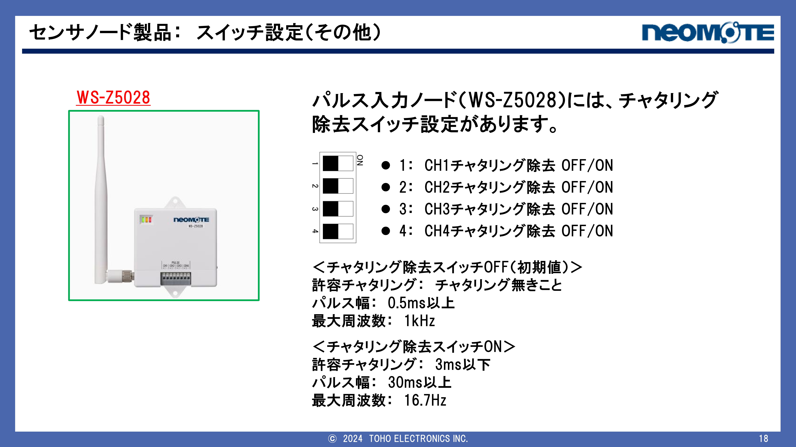
---

## ■ アナログ入力（WS-Z5036）

入力選択：

- 4〜20mA  
- 1〜5V  
- 0〜10V  

👉 ONが優先される 

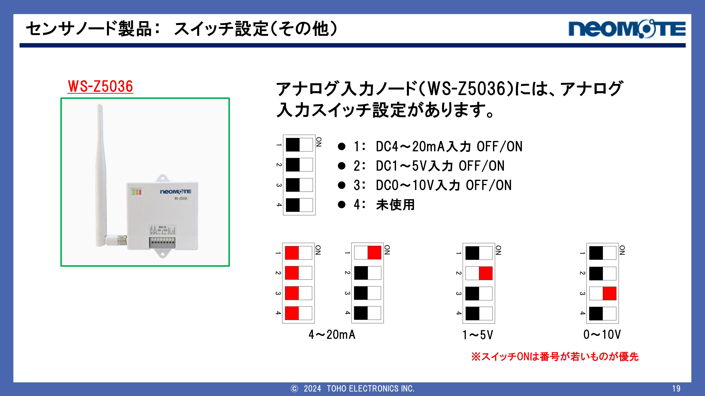
---

# ■ 注意事項（超重要）

・NODE-ID重複禁止  
・RF-CH / GR-ID / 無線モードは必ず統一  
・設定後は必ず通信確認  

---

# ■ トラブル対応

### 通信できない

・設定4項目を確認  
・NODE-ID重複確認  
・距離・障害物確認  

---

参考図

# ■ メモ

