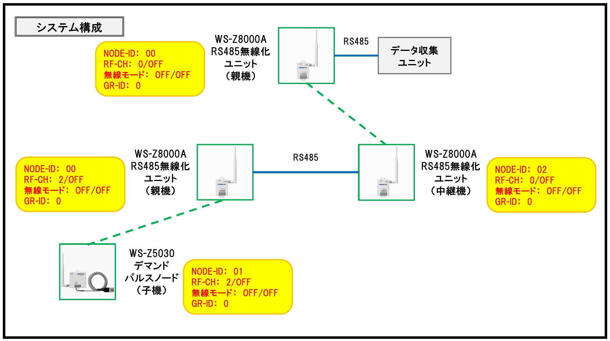
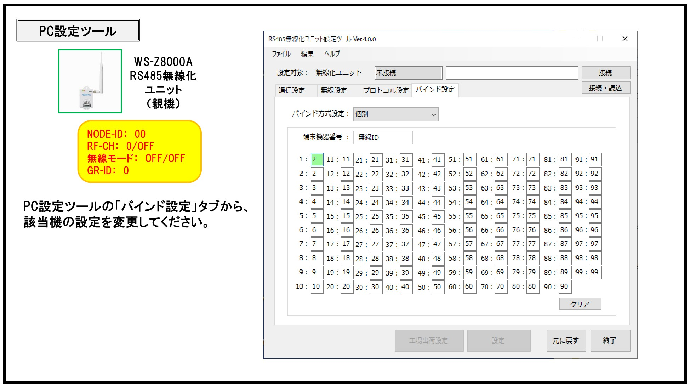

# 中継機同士の有線接続（RS485）

Version 1.0  
最終更新日：2023-06-03

---

## 概要

RS485無線化ユニット（ネオモト）同士を有線接続し、  
中継機として動作させるための設定方法です。

---

## 対象

・現場施工担当者  
・エコミラ設置担当者  
・通信設定担当者  

---

## ゴール

・中継機を有線接続できる  
・通信経路を構築できる  

---

## システム構成

RS485で各ユニットを接続し、通信ネットワークを構築します。

- 親機（WS-Z8000A）
- 中継機（WS-Z5030）
- 子機（パルスノード）

👉 RS485で数珠つなぎに接続

---

## 設定内容

各ユニットの設定は以下とします。

| 項目 | 設定値 |
|------|--------|
| NODE-ID | 00 / 01 / 02（重複不可） |
| RF-CH | 0 または 2 |
| 無線モード | OFF / OFF |
| GR-ID | 0 |

※機器ごとにNODE-IDは必ず変更する

---

## 手順

### ① RS485配線

・各ユニットをRS485で接続する  
・極性（＋/－）に注意  

---

### ② PC設定ツールで設定

PC設定ツールを使用して設定を行います。

1. 対象機器に接続  
2. 「バインド設定」タブを開く  
3. 各ユニットの設定を変更  

👉 バインド設定から変更する

---

### ③ 動作確認

・通信が成立しているか確認  
・各ノードが認識されているか確認  

---

## 注意事項

・NODE-IDの重複は禁止  
・配線ミス（極性）に注意  
・設定後は必ず動作確認  

---

## トラブル対応

### 通信できない場合

・NODE-IDの重複確認  
・配線の確認  
・設定内容の再確認  

---

## 参考図

## メモ

