# データロガー（R5051）運用マニュアル（エコミラ用）

Version 1.0
最終更新日：2026-03-21

---

## ■ 概要

データロガー（R5051）を使用して空調機の電流データを取得し、
電力（kW / kWh）に変換して、エコミラの削減提案に活用する手順です。

---

## ■ 対象

・現場施工担当者
・データ解析担当者
・営業担当者（提案用データ作成）

---

## ■ ゴール

・電流データを取得できる
・電力（kW / kWh）に変換できる
・提案に使えるCSVデータを作成できる

---

## ■ 全体の流れ

① データ取り込み
② データ確認
③ 電力変換
④ データ整理
⑤ CSV出力

---

## ■ ① データ取り込み

### 手順

1. コミュニケーションアダプターをPCに接続
2. ロガーをセット（センサー部分を合わせる）
3. 自動でデータ取り込み開始

👉 セットするだけで自動取り込み

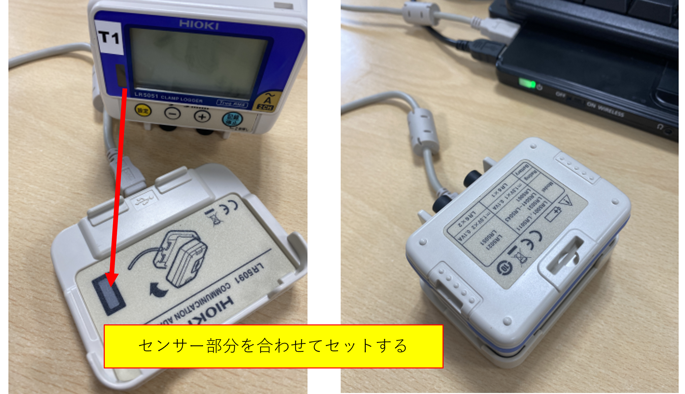
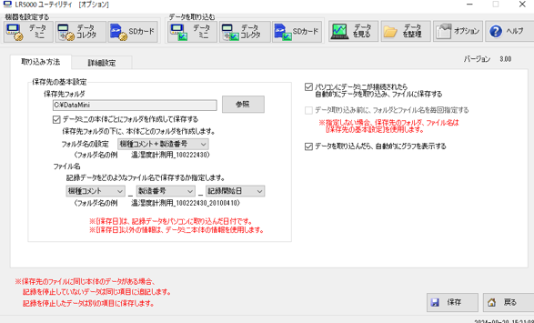
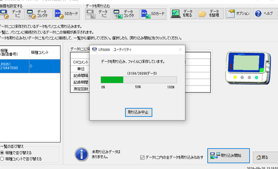

---

### ■ 注意

・保存先フォルダは事前に決める
・ファイル名ルールを統一する

---

## ■ ② データ確認

### 手順

1. データ取り込み完了後、グラフが表示される
2. 「表」に切り替える
3. 不要な表示（色設定など）は閉じる

👉 表形式で作業する

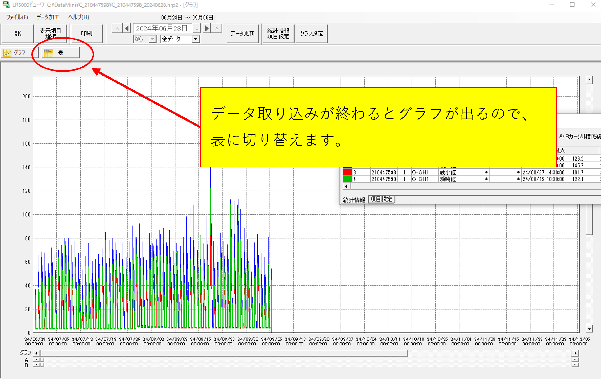
---

## ■ ③ 電力変換（最重要）

### 手順

「データ加工」→「電力演算」を選択

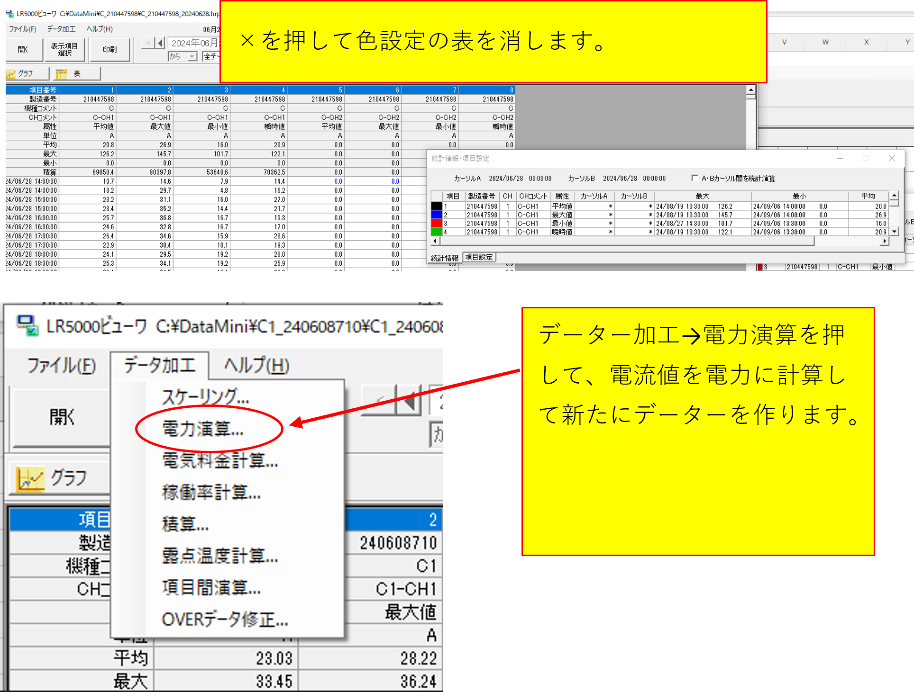

---

### ■ CH1設定

| 項目   | 設定値     |
| ---- | ------- |
| 電流1  | CH1 平均値 |
| 電流2  | 使用しない   |
| 期間   | 全期間     |
| 電力種類 | 三相3線    |
| 電圧1  | 200V    |
| 電圧2  | 0       |
| 力率   | 0.8     |
| 単位   | kW      |

👉 パッケージエアコンはほぼこの設定

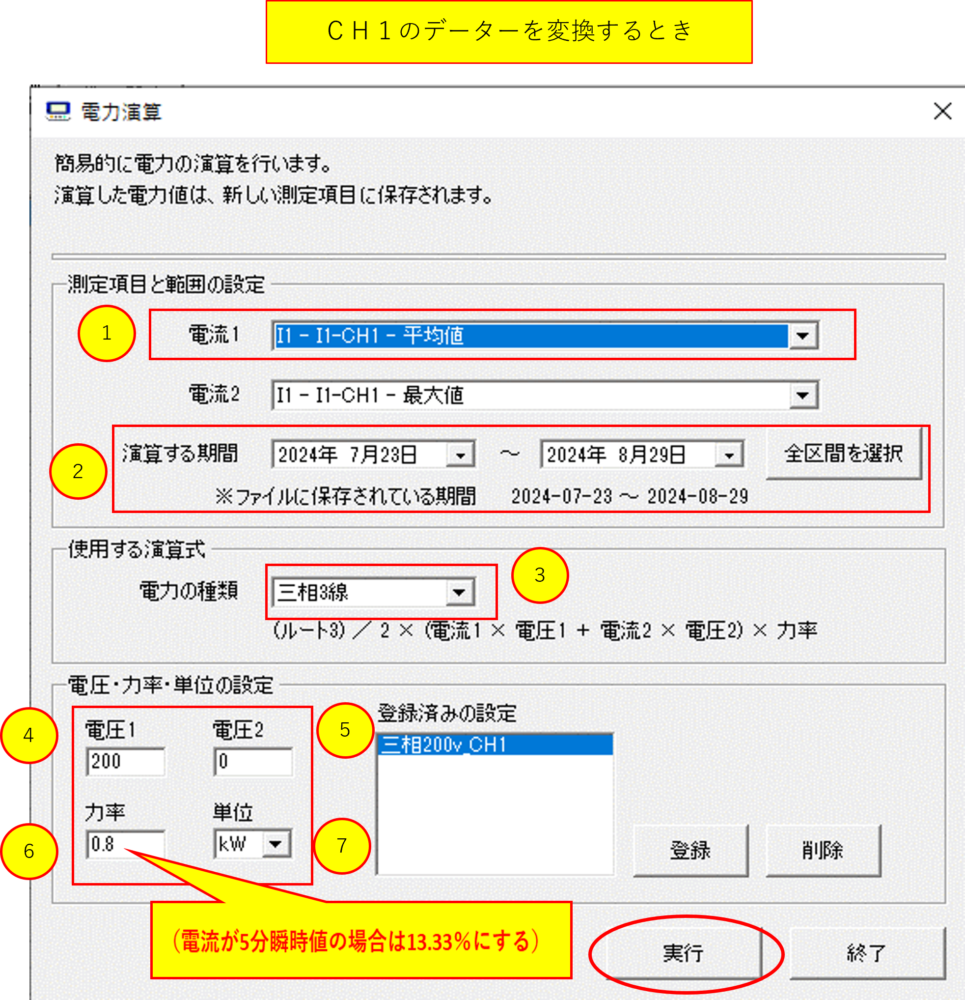
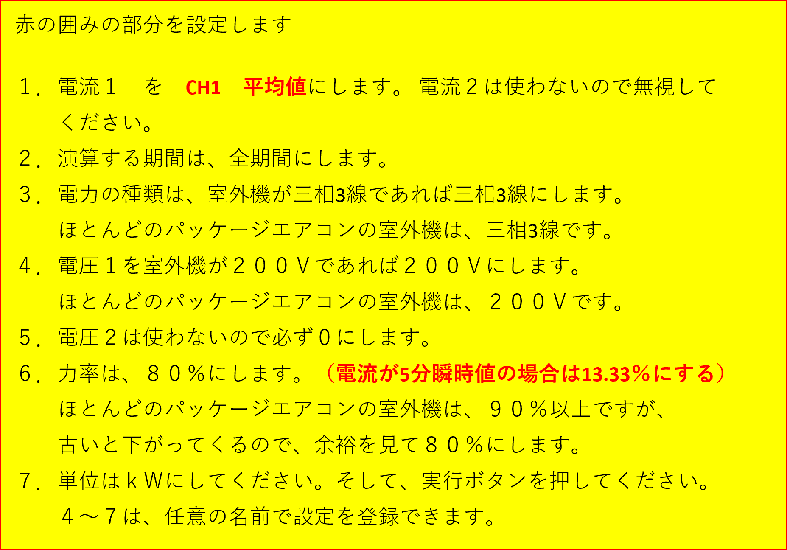
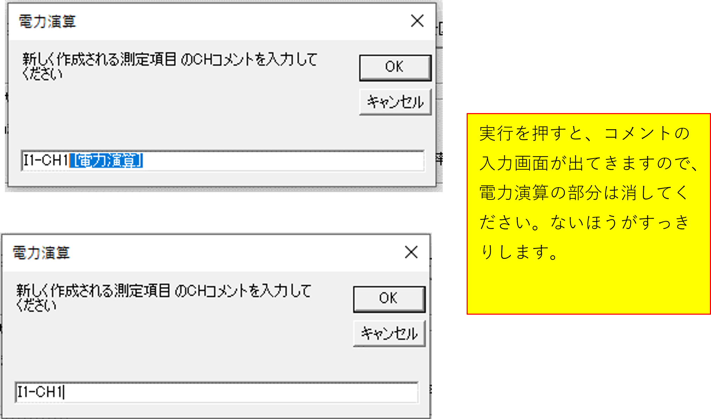
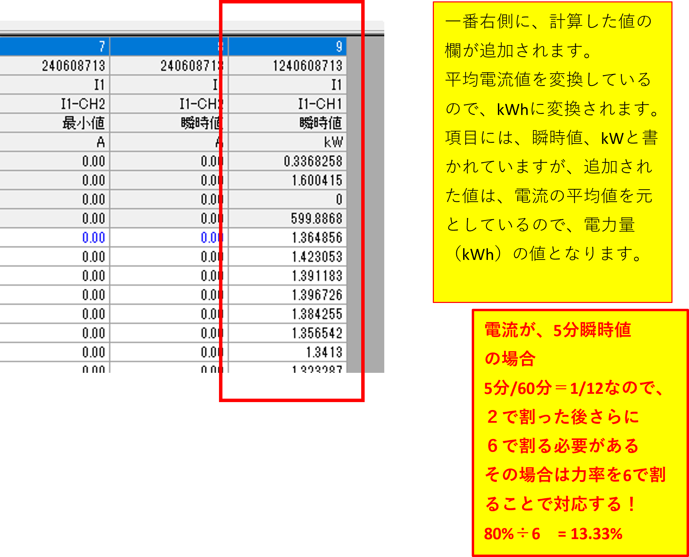
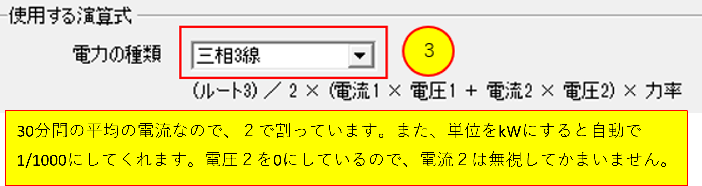
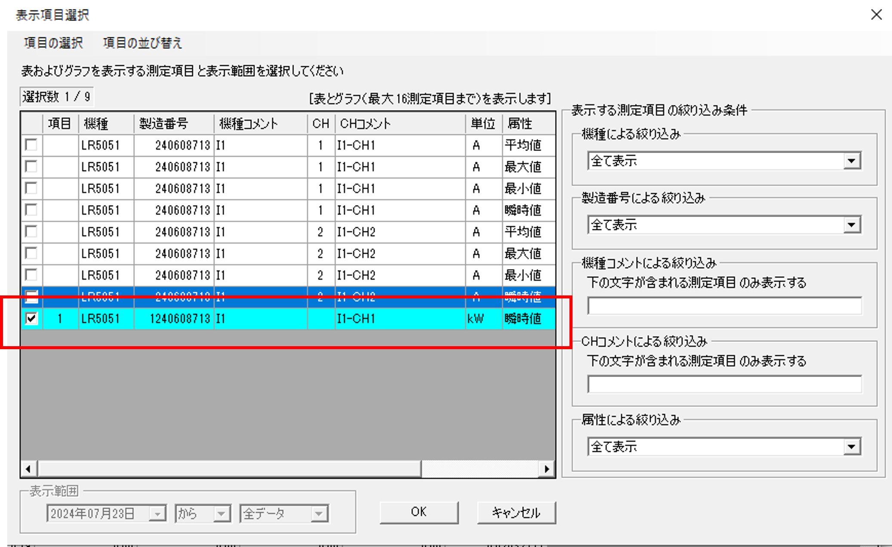
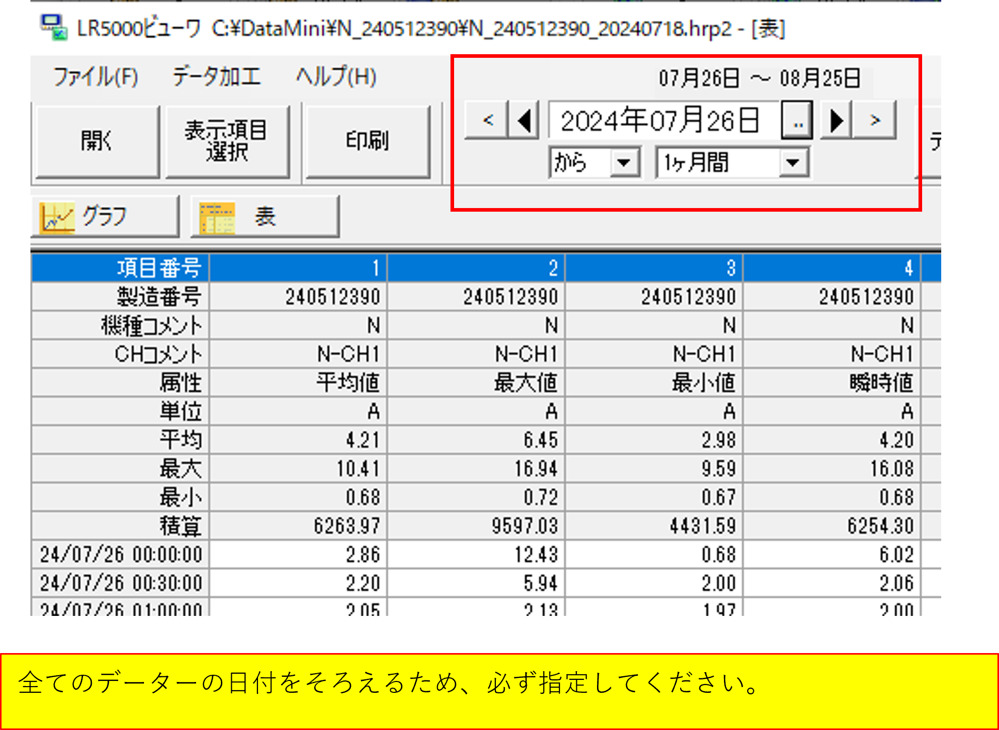
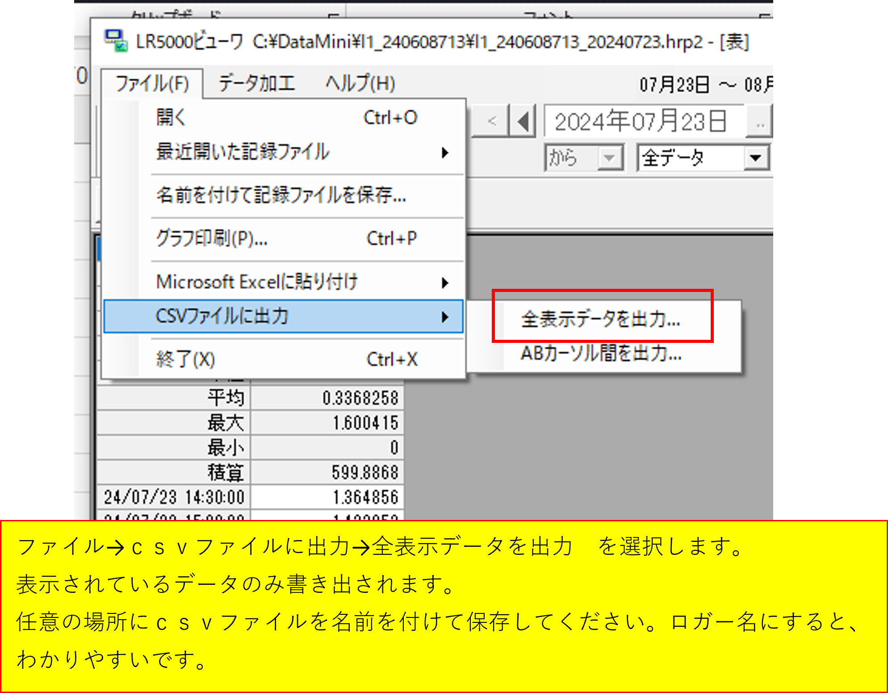
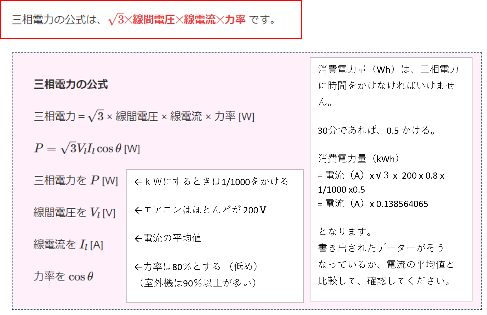

---

### ■ CH2設定（ある場合）

・電流1 → CH2平均値
・それ以外はCH1と同じ

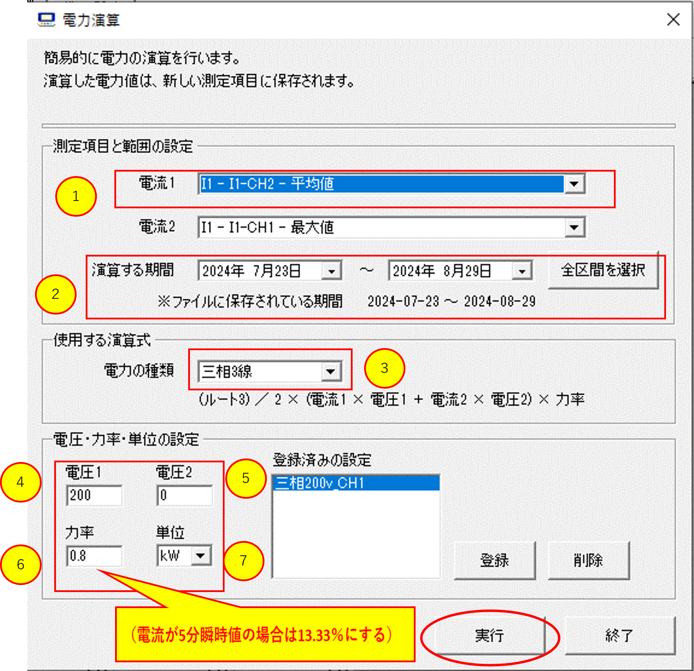
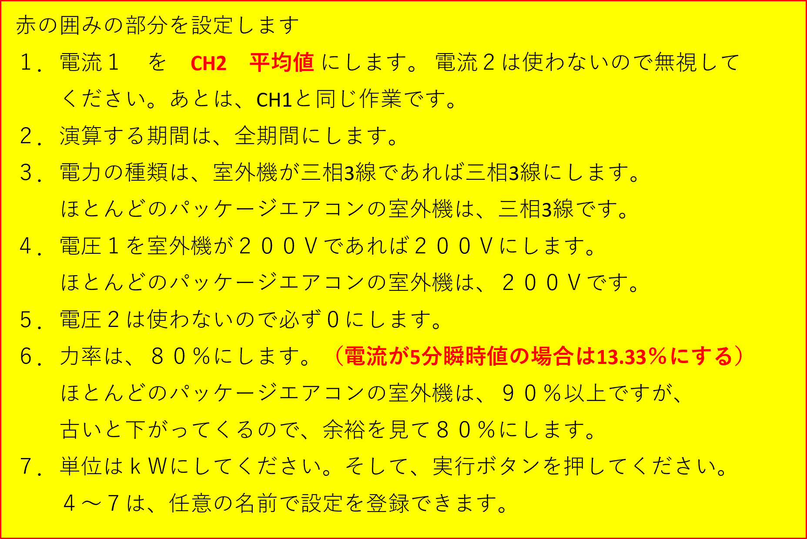
---

### ■ 計算の考え方

電力（W）＝ √3 × 電圧 × 電流 × 力率

---

### ■ 実務用の簡略式

kWh ≒ 電流 × 0.138

---

### ■ なぜ0.138？

√3 × 200 × 0.8 × 1/1000 × 0.5 ≒ 0.138

---

### ■ 注意（5分データの場合）

力率 = 13.33%

理由：
5分 ÷ 60分 = 1/12

---

### ■ 実行後

・新しい列が追加される
・値は電力量（kWh）になる

---

## ■ ④ データ整理

### 手順

1. 表示項目を整理
2. kW（またはkWh）のみ残す
3. 測定期間を指定

---

### ■ 理由

・不要データ削除
・見やすさ向上
・分析しやすくする

---

## ■ ⑤ CSV出力

### 手順

1. ファイル
2. CSVファイルに出力
3. 全表示データを出力

👉 表示されているデータのみ出力される

---

### ■ 保存ルール

・分かりやすい名前を付ける
・例：店舗名＋日付

---

## ■ 電力計算まとめ

kWh = 電流 × √3 × 200 × 0.8 × 1/1000 × 0.5
= 電流 × 0.138564

👉 実務では「0.138」でOK

---

## ■ エコミラとの関係

ロガー → 現状把握
エコミラ → 削減制御

👉 このデータが提案の根拠になる

---

## ■ よくあるミス

・電圧設定ミス（200V忘れ）
・力率設定ミス
・期間設定していない
・kWとkWhの混同
・5分データ補正忘れ

---

## ■ メモ

（現場ごとに記入）
